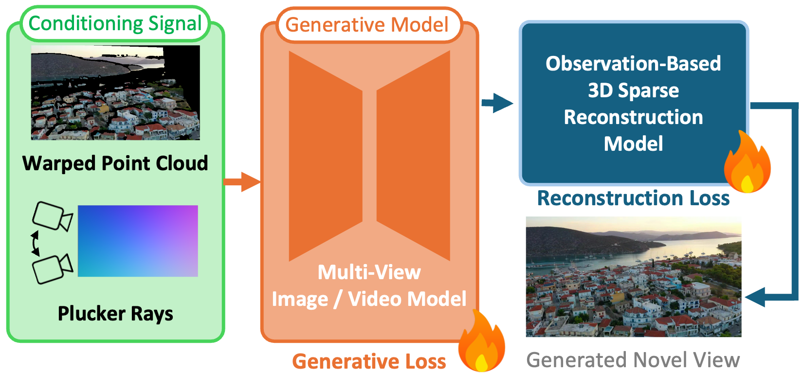

<h2 align="center">GenRec: Knowing Where to Reconstruct and Where to Generate</h2>

<p align="center">
  <a href="https://github.com/atcelen">Ata Çelen</a><sup>1</sup>&nbsp;&nbsp;
  <a href="https://crepejung00.github.io/">Jaewoo Jung</a><sup>1,4</sup>&nbsp;&nbsp;
  <a href="https://federicotombari.github.io/">Federico Tombari</a><sup>2</sup>&nbsp;&nbsp;
  <a href="https://people.inf.ethz.ch/marc.pollefeys/">Marc Pollefeys</a><sup>1,3</sup>&nbsp;&nbsp;
  <a href="https://sunghwanhong.github.io/">Sunghwan Hong</a><sup>1</sup>&nbsp;&nbsp;
  <a href="https://m-niemeyer.github.io/">Michael Niemeyer</a><sup>2</sup>&nbsp;&nbsp;
  <a href="https://cvg.ethz.ch/team/Dr-Daniel-Bela-Barath">Daniel Barath</a><sup>1,2</sup>&nbsp;&nbsp;
</p>

<p align="center"><b>Arxiv 2026</b></p>

<p align="center">
  <sup>1</sup>ETH Zürich&nbsp;&nbsp;&nbsp;<sup>2</sup>Google&nbsp;&nbsp;&nbsp;<sup>3</sup>Microsoft&nbsp;&nbsp;&nbsp;<sup>4</sup>KAIST
</p>

<!-- TODO(release): fill in the real arXiv id and project-page URL below. -->
<h3 align="center">
  <a href="https://arxiv.org/abs/XXXX.XXXXX"></a>&nbsp;
  <a href="https://atcelen.github.io/GenRec/"></a>&nbsp;
  <a href="https://huggingface.co/atcelen/GenRec"></a>&nbsp;
  <a href="LICENSE"></a>
</h3>

<p align="center">
  
</p>

---

GenRec turns one or a few photos of a scene into novel camera views. Pixels
that the input photos actually observe are **reconstructed** faithfully; pixels
they don't are **generated** by a diffusion prior — and the model knows which is
which. Guided by an observation mask derived from the source cameras and a
monocular depth estimator, a multi-view flow matching backbone jointly denoises
RGB and scene-coordinate maps across all target views, while a pixel-space
refinement stage restores high-frequency detail on observed pixels. Across
RealEstate10K, DL3DV-10K, and Mip-NeRF 360, GenRec attains the best
reconstruction fidelity in observed regions while surpassing purely generative
baselines on perceptual quality in unobserved ones.

## Quick Start

```bash
git clone https://github.com/atcelen/GenRec.git && cd GenRec
python -m venv .venv && source .venv/bin/activate
pip install torch torchvision --index-url https://download.pytorch.org/whl/cu128
pip install -e .

INPUT_DIR=assets/examples bash scripts/run_inference.sh
```

That's it — all model weights download automatically on first run, and the
generated views land in `./custom_out/frames/`. Point `INPUT_DIR` at a folder of
your own photos to try your scenes.

## Requirements

- Linux, Python 3.10–3.12
- PyTorch ≥ 2.8 with a CUDA 12.x toolkit (install it first, matched to your
  CUDA version — see [pytorch.org](https://pytorch.org/))
- An NVIDIA GPU with 40 GB+ VRAM

`pip install -e .` installs everything else (a pinned `requirements.txt` is
provided as an equivalent alternative).

## Pretrained Weights

Nothing to download manually. On first run GenRec fetches its checkpoint
(~2.7 GB) and the [Depth Anything 3](https://github.com/ByteDance-Seed/Depth-Anything-3)
geometry backbone from HuggingFace and caches them locally.

To use your own checkpoint, pass a path or URL instead of the default name:

```bash
CHECKPOINT=/path/to/my_checkpoint.safetensors bash scripts/run_inference.sh
```

Or from Python:

```python
from genrec import load_genrec
model = load_genrec("configs/dl3dv.yaml")   # weights auto-download
```

## Usage

### Novel views from your own images

Drop one or more images into a folder:

```bash
INPUT_DIR=./my_photos bash scripts/run_inference.sh
```

The camera trajectory is generated for you:

- **One image** → a camera path around it. Choose the style with
  `TRAJECTORY=orbit|dolly|spiral|wiggle` and its amplitude with `MOTION_SCALE`.
- **Two or more images** → smooth interpolation between your viewpoints.

Everything about the input cameras (depth, poses, intrinsics) is estimated
automatically. Inputs are resized and center-cropped to roughly 16:9 at 616 px
wide to match the training distribution — very tall portrait photos will lose
some top/bottom content.

Outputs, written to `OUTPUT_DIR` (default `./custom_out`):

```
frames/frame_000.png   generated novel views
inputs/input_000.png   your inputs at model resolution
depths/depth_000.npy   estimated input depths
poses.json             all camera poses + intrinsics used
```

**Want specific cameras instead of a generated path?** The run above emits a
`poses.json`; edit it (or write your own with the same schema) and re-run:

```bash
INPUT_DIR=./my_photos POSES=./custom_out/poses.json bash scripts/run_inference.sh
```

The file holds `target_c2w` (4×4 camera-to-world matrices, one per view to
render) and optionally per-view intrinsics. See
`python -m genrec.cli.inference --help` for all options.

### Reproducing the paper's evaluation

Each benchmark has a one-line entry point that applies the paper's protocol:

```bash
DATA_PATH=/path/to/RealEstate10K bash scripts/run_eval_re10k.sh
DATA_PATH=/path/to/DL3DV-10K     bash scripts/run_eval_dl3dv.sh
DATA_PATH=/path/to/mipnerf360    bash scripts/run_eval_mipnerf360.sh
```

Each writes renders and a metrics summary (PSNR / SSIM / LPIPS split into
observed vs. unobserved regions, plus FID, FD-DINOv2, and CLIP-IQA) to
`OUTPUT_DIR`. The observed/unobserved split uses the paper's observation masks,
which download automatically — so the split is exactly reproducible. Any flag can be overridden by appending it, e.g.
`bash scripts/run_eval_re10k.sh --num_steps 30`, and multi-GPU evaluation works
via `torchrun --nproc_per_node=4 -m genrec.cli.eval_re10k ...`.

## Data

Only the evaluation needs datasets — inference on your own photos does not.

- **Mip-NeRF 360** works out of the box: point `DATA_PATH` at the standard
  scene folders (COLMAP `sparse/0` + `images_4/`).
- **RealEstate10K** and **DL3DV-10K** are converted once into a per-scene
  format:

```bash
# RealEstate10K — from the official camera files + your extracted frames:
python scripts/preprocess_re10k.py \
    --poses_dir /path/to/RealEstate10K/test \
    --frames_dir /path/to/frames \
    --output_dir /path/to/RealEstate10K_processed

# ... or, if you already have the pixelSplat/depthsplat chunks, reuse them:
python scripts/preprocess_re10k.py \
    --from_chunks /path/to/re10k/test \
    --output_dir /path/to/RealEstate10K_processed

# DL3DV-10K — from the standard scene folders:
python scripts/preprocess_dl3dv.py \
    --input_dir /path/to/DL3DV-10K \
    --output_dir /path/to/DL3DV-10K_processed
```

Both scripts take `--limit N` to convert just a few scenes as a smoke test.
Then pass the processed directory as `DATA_PATH`. The exact on-disk schema is
documented in [docs/data_format.md](docs/data_format.md) if you want to plug in
your own dataset.

## Repository Structure

```
genrec/                Model, dataset loaders, and CLI entry points
  cli/                 inference.py + per-dataset evaluation entry points
depth_anything_3/      Vendored Depth Anything 3 (geometry backbone)
configs/               Inference configs (re10k.yaml, dl3dv.yaml)
scripts/               Run scripts + dataset preprocessing
assets/examples/       Sample inputs for the quick start
docs/                  Dataset format reference
```

## Contact

For questions, please open an issue or contact
[ata.celen@inf.ethz.ch](mailto:ata.celen@inf.ethz.ch).

## Acknowledgements

GenRec builds on [Depth Anything 3](https://github.com/ByteDance-Seed/Depth-Anything-3)
for geometry and on [SpatialGen](https://github.com/manycore-research/SpatialGen)
for the VAE and ray encoder weights. We thank the authors of these projects.

## License

Code released under the Apache License 2.0 (see [`LICENSE`](LICENSE)). The vendored
`depth_anything_3/` code retains its original license. The released **model
weights** inherit the non-commercial terms of their upstream sources (SpatialGen,
Depth Anything 3) and the training datasets, and are intended for research use only.

## Citation

<!-- TODO(release): replace with the final title, author list, and arXiv eprint. -->
```bibtex
@misc{genrec,
  title  = {GenRec: Knowing Where to Reconstruct and Where to Generate},
  author = {Çelen, Ata and Jung, Jaewoo and Tombari, Federico and Pollefeys, Marc and Hong, Sunghwan and Niemeyer, Michael and Barath, Daniel},
  year   = {2026}
}
```
